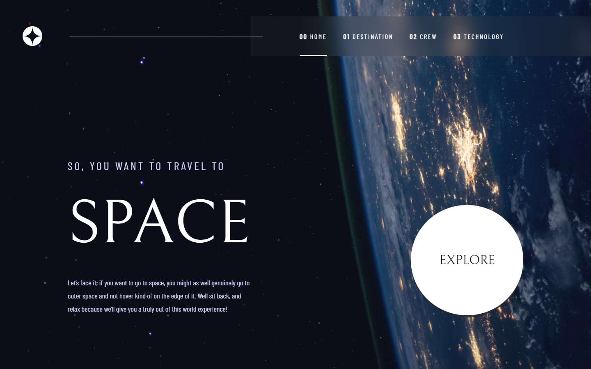

# Frontend Mentor - Space tourism website solution

This is a solution to the [Space tourism website challenge on Frontend Mentor](https://www.frontendmentor.io/challenges/space-tourism-multipage-website-gRWj1URZ3). Frontend Mentor challenges help you improve your coding skills by building realistic projects. 

That was my fist react project!
Its is responsive for mobile(375px), tablet(530px - 768px) and desktop(1100px - 1440px)
It also has some animations(check it out).

Obs: If you're using Firefox, you should see some bugs at the navigation bar. That's because Firefox does not have the backdrop-filter property full implemented yet. Therefore, it's disabled by default but you can enable it. But even then it wouldn't show all the effects.

## Table of contents

- [Overview](#overview)
  - [The challenge](#the-challenge)
  - [Screenshot](#screenshot)
  - [Links](#links)
- [My process](#my-process)
  - [Built with](#built-with)
  - [What I learned](#what-i-learned)
  - [Useful resources](#useful-resources)
- [Author](#author)

## Overview

### Screenshot

### Links

- Live Site URL: [LIVE SITE URL](https://phmac7-space.netlify.app/)
- Solution URL: [Compare Solution](https://your-solution-url.com)

## My process

### Built with

- HTML5
- CSS3 custom properties
- JS
- [React](https://reactjs.org/) - JS library

### What I learned

Well, since that was my first react project i've learned A LOT.
Things like animations, routing links etc...

And almost everything that is included in the project i've learned searching on the web.

### Useful resources

- [Stackoverflow](https://stackoverflow.com/) - lol
- [React Documentation](https://reactjs.org/docs/getting-started.html)

## Author

- Website - [Pedro Machado](github.com/phmac7)
- Frontend Mentor - [@phmac7](https://www.frontendmentor.io/profile/phmac7)
